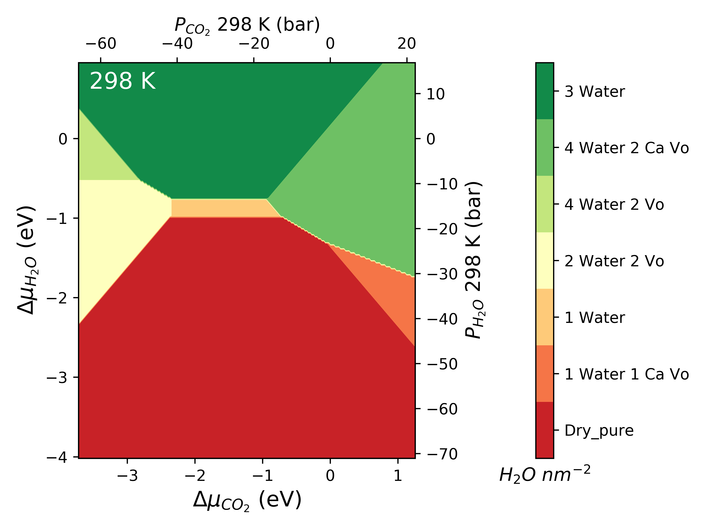
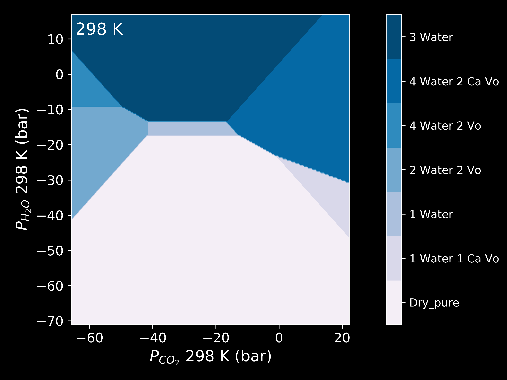
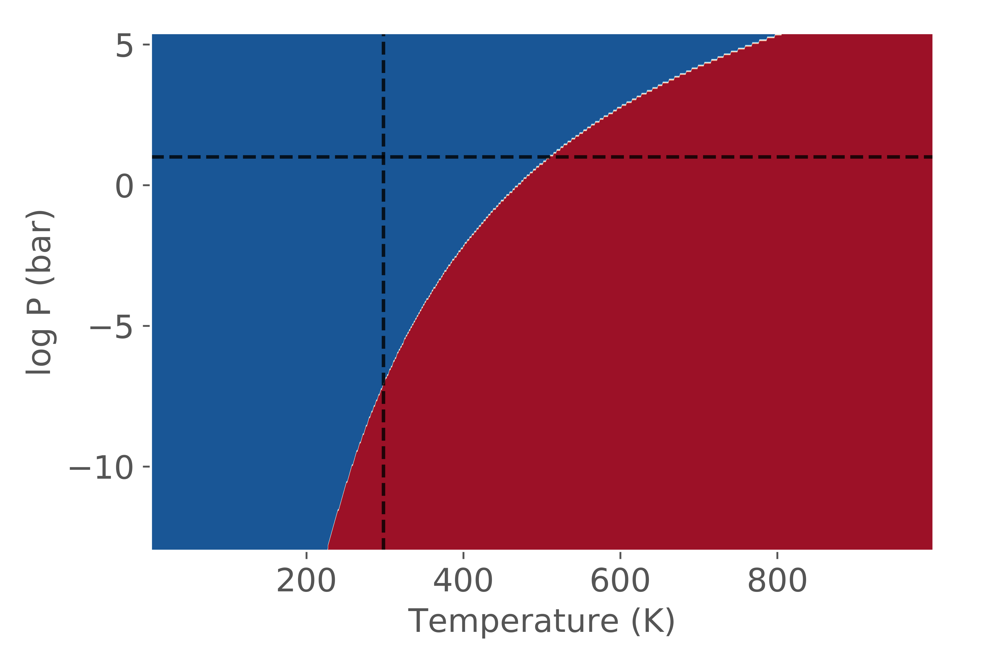

Gallery
=======

The gallery is a preview of some of the plots available in ``surfinpy``. Clicking on a plot will provide a link to a tutorial 
for generating the plot. 

chemical potential
~~~~~~~~~~~~~~~~~~~~~~~~~~~~~~~~~~~~~~~~~~~~~~~~~

The following are examples of a phase diagram as a function of chemical potential. The first is the default output 
and the rest are generated by playing with the style and colourmap.

.. image:: Figures/default.png
    :height: 300px
    :align: center
    :target: tutorial_1.html

.. image:: Figures/fast.png
    :height: 300px
    :align: center
    :target: tutorial_1.html

Chemical potential and pressure
~~~~~~~~~~~~~~~~~~~~~~~~~~~~~~~

.. image:: Figures/Example_dark_mp.png
    :height: 300px
    :align: center
    :target: tutorial_1.html#Pressure

Pressure
~~~~~~~~

Temperature vs Pressure
~~~~~~~~~~~~~~~~~~~~~~~

.. image:: Figures/dark_pvt.png
    :height: 300px
    :align: center
    :target: tutorial_2.html

Particle Morphology
~~~~~~~~~~~~~~~~~~~

.. image:: Figures/Wulff.png
    :height: 300px
    :align: center
    :target: tutorial_3.html
