Gallery
=======

The gallery is a preview of some of the plots available in ``surfinpy``. Clicking on a plot will provide a link to a tutorial 
for generating the plot. 

Surfaces
--------

chemical potential
~~~~~~~~~~~~~~~~~~

The following are examples of a phase diagram as a function of chemical potential. The first is the default output 
and the rest are generated by playing with the style and colourmap.

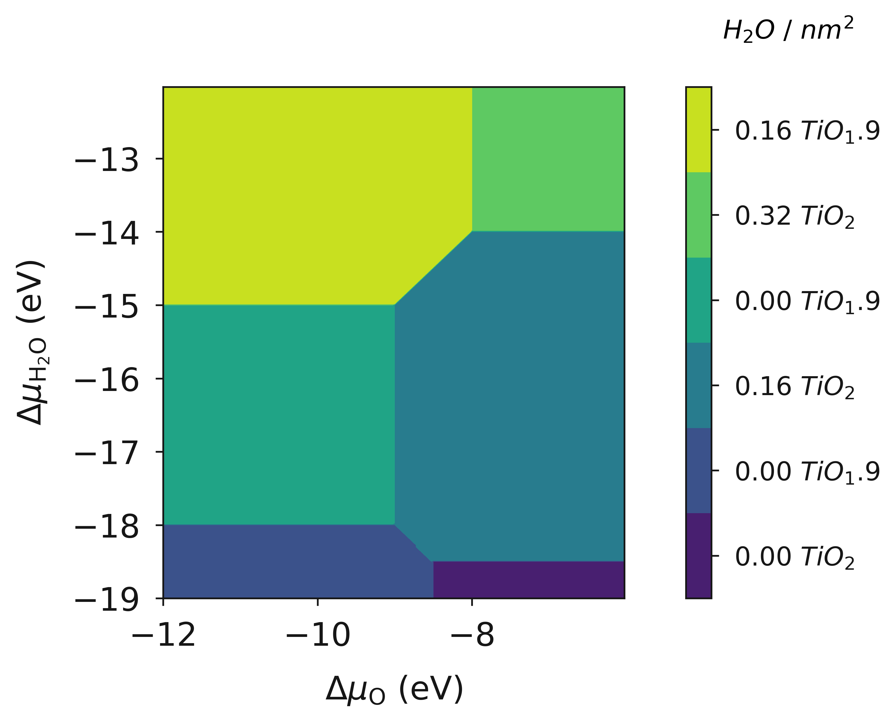

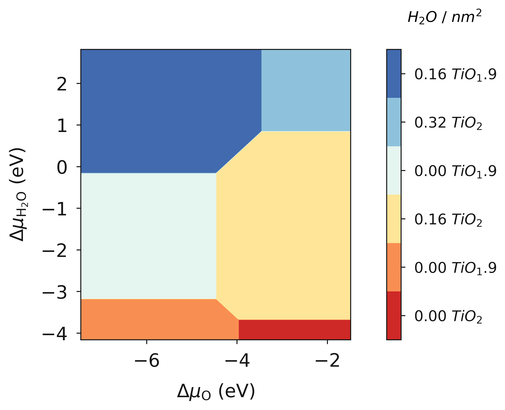

Pressure
~~~~~~~~

Chemical potential can be converted to pressure and a diagram with pressure of species A/B displayed.

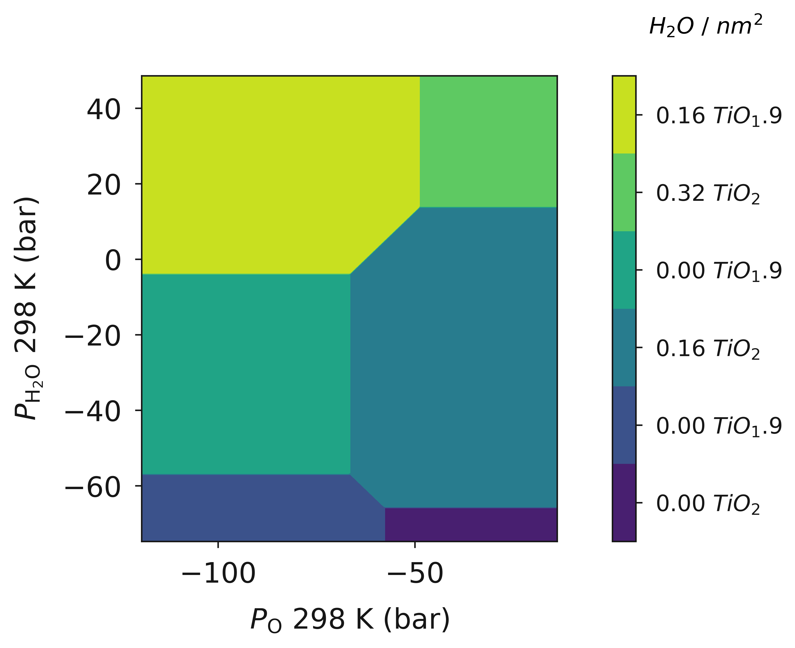

Chemical potential and pressure
~~~~~~~~~~~~~~~~~~~~~~~~~~~~~~~

`surfinpy` can produce a plot with the chemical potential of A/B on axes X/Y and the pressure of 
A/B on axes X2/Y2. 

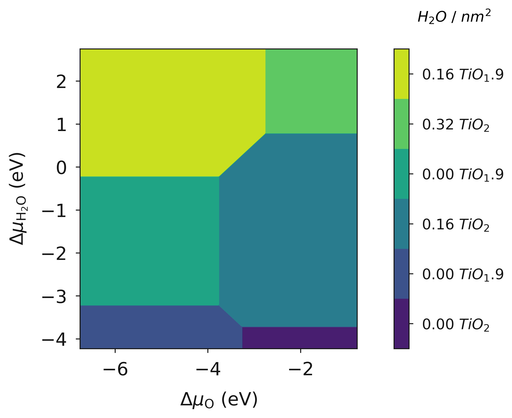
    
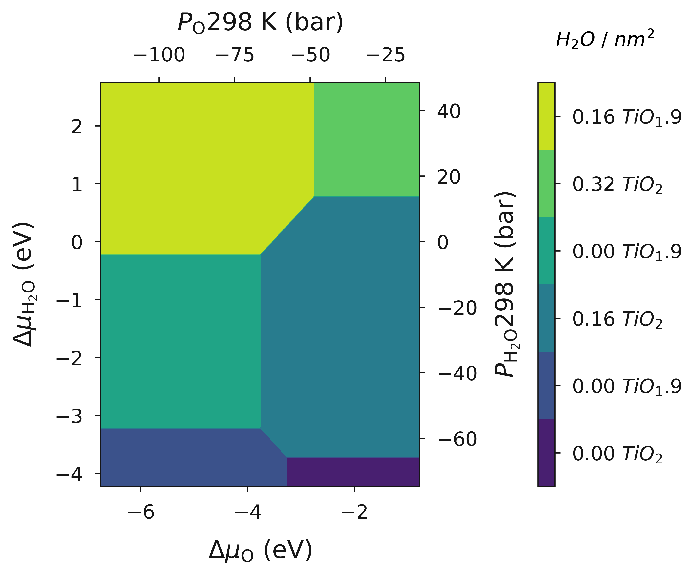

Temperature vs Pressure
~~~~~~~~~~~~~~~~~~~~~~~

`surfinpy` can produce simple pvt plots showing the relationship between a single species "A" at the surface e.g. water.

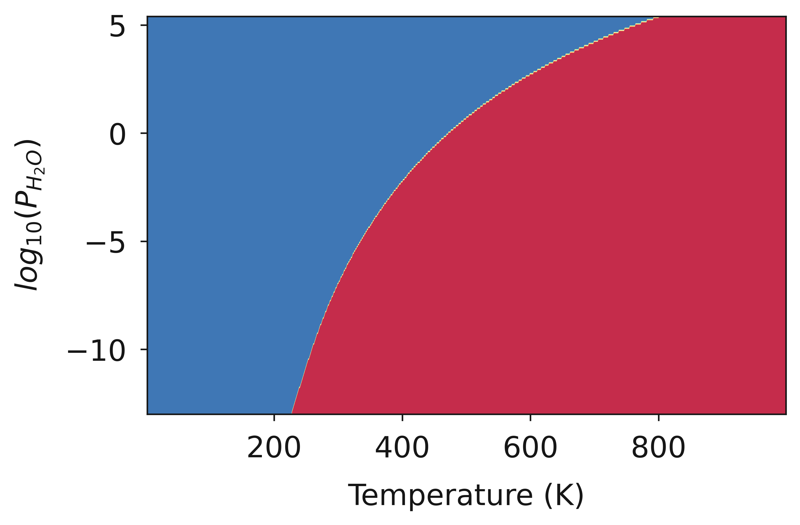

Particle Morphology
~~~~~~~~~~~~~~~~~~~

`surfinpy` provides examples of how to use the surface energy calculation alongside pymatgen to generate particle morphologies 
at different temperature and pressure values.

.. image:: Figures/Tutorial_3/Wulff.png
    :height: 300px
    :align: center
    :target: tutorial_3.html

Bulk
----

Chemical Potential
~~~~~~~~~~~~~~~~~~

The following are examples of a phase diagram as a function of chemical potential.

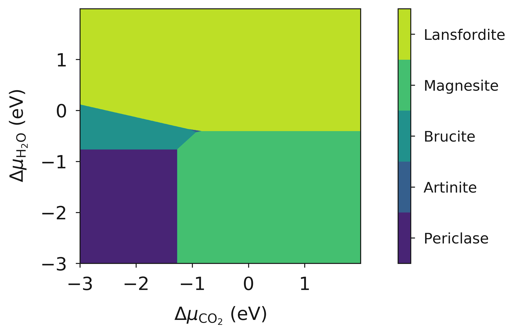

Temperature
~~~~~~~~~~~

The following are examples of a phase diagram as a function of chemical potential with a temperature contribution introduced.

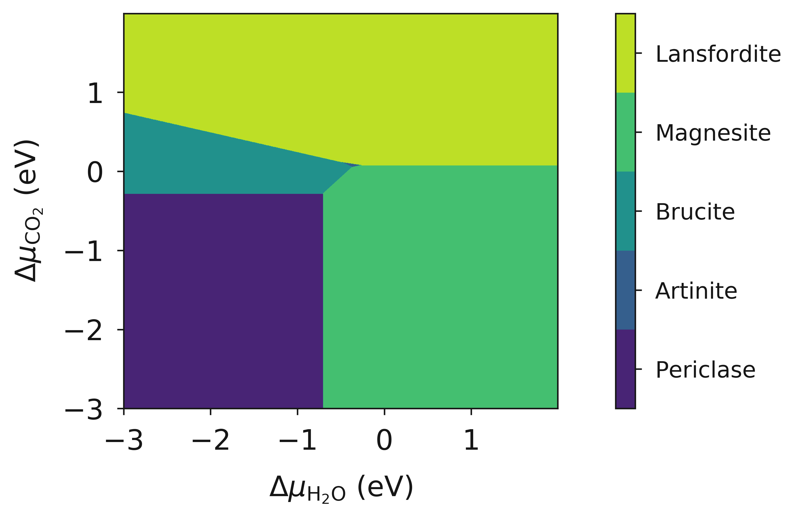

Pressure
~~~~~~~~

The following are examples of a phase diagram as a function of pressure.

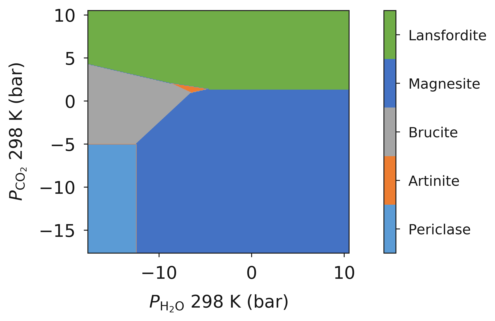

Pressure vs Temperature
~~~~~~~~~~~~~~~~~~~~~~~

The following are examples of a phase diagram as a function of chemical potential, chemical potential and pressure, and temperature.

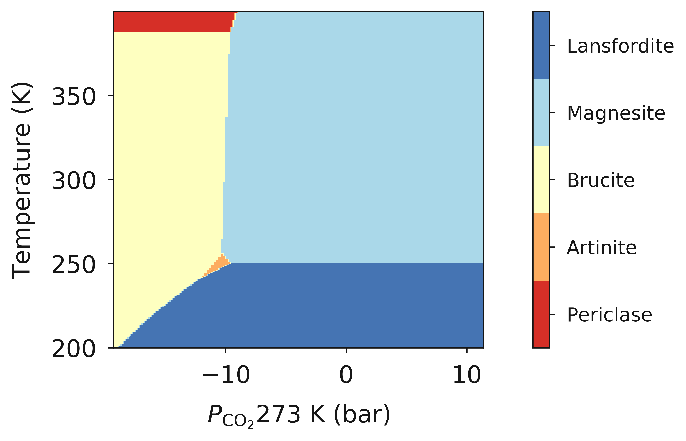

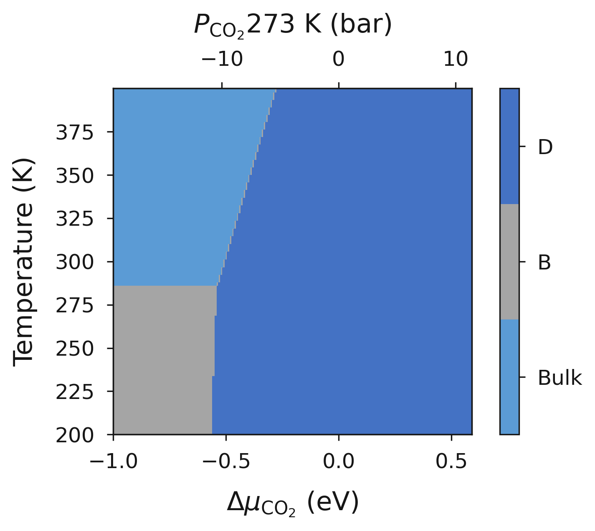

Vibrational Entropy
~~~~~~~~~~~~~~~~~~~

The following are examples of how to include the effects of vibrational entropy to the phase diagrams.

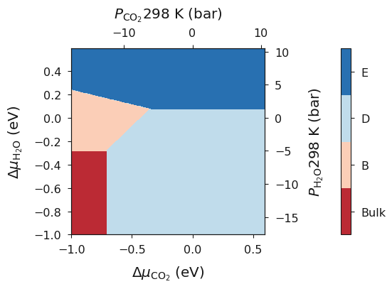

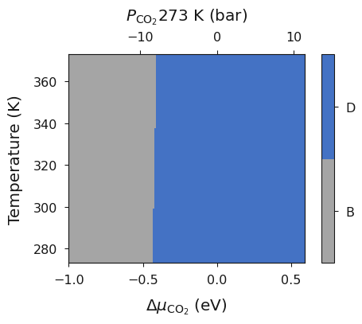

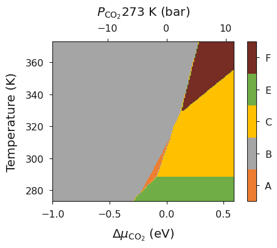
