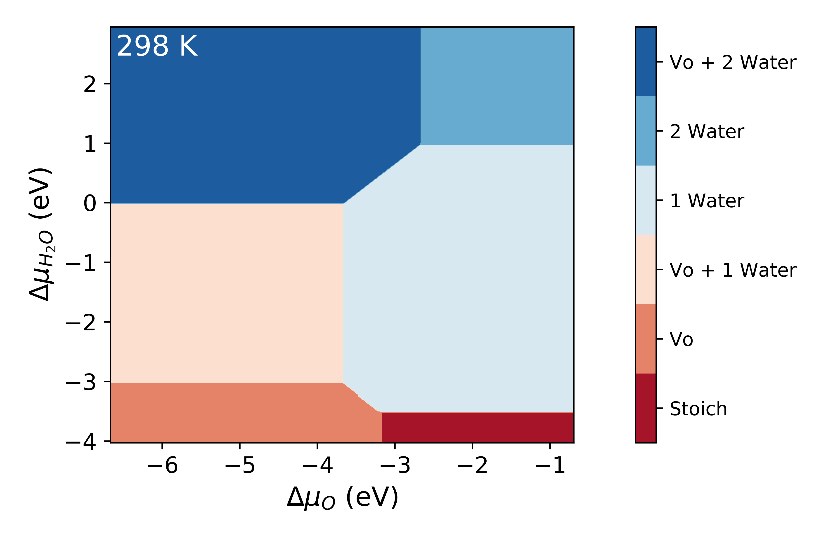
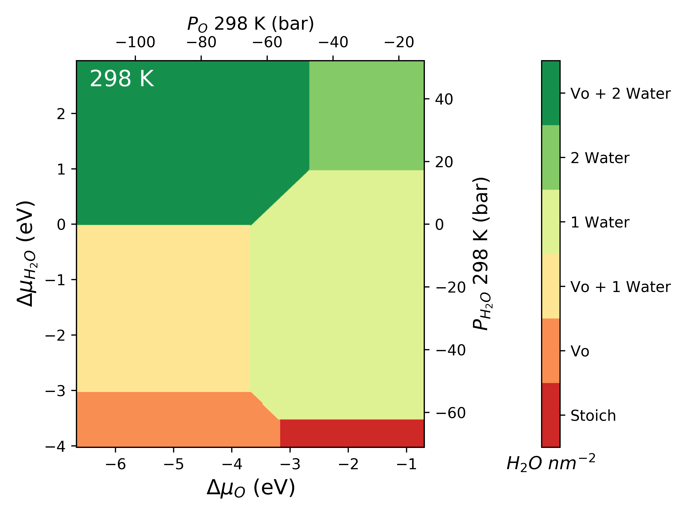
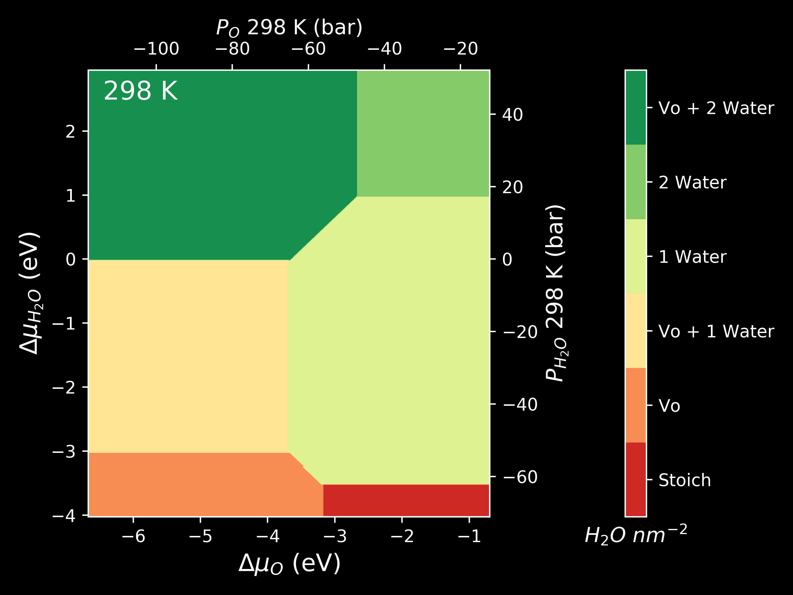
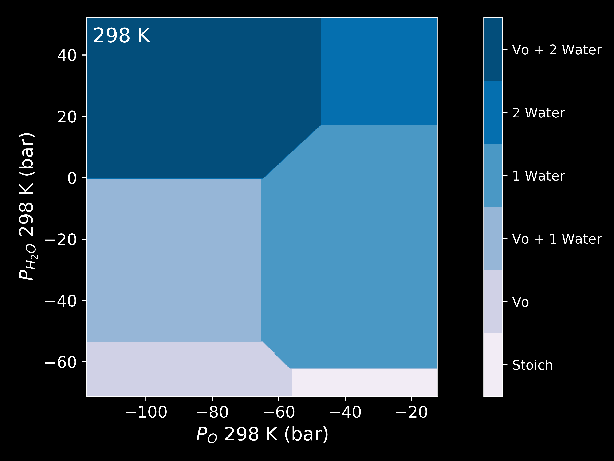

Chemical Potential
==================

The physical quantity that is used to define the stability of a surface with a given composition is its surface energy :math:`\gamma` (J :math:`m^{-2}`).
At its core, `surfinpy` is a code that calculates the surface energy of different slabs and uses these surface energies to build a phase diagram.
In this explanation of theory we will use the example of water adsorbing onto a surface of :math:`TiO_2` containing oxygen vacancies.
In such an example there are two variables, water concentration and oxygen vacancy concentration. We are able to calculate the surface energy according to

.. math::
    \gamma_{Surf} = \frac{1}{2A} \Bigg( E_{TiO_2}^{slab} - \frac{nTi_{slab}}{nTi_{Bulk}} E_{TiO_2}^{Bulk} \Bigg) - \Gamma_O \mu_O - \Gamma_{H_2O} \mu_{H_2O} ,

where A is the surface area, :math:`E_{TiO_2}^{slab}` is the DFT energy of the slab, :math:`nTi_{Slab}` is the number of cations in the slab,
:math:`nTi_{Bulk}` is the number of cations in the bulk unit cell, :math:`E_{TiO_2}^{Bulk}` is the DFT energy of the bulk unit cell and

.. math::
    \Gamma_O = \frac{1}{2A} \Bigg( nO_{Slab} - \frac{nO_{Bulk}}{nTi_{Bulk}}nTi_{Slab}  \Bigg) ,

.. math::
    \Gamma_{H_2O} = \frac{nH_2O}{2A} ,

where :math:`nO_{Slab}` is the number of anions in the slab, :math:`nO_{Bulk}` is the number of anions in the bulk and :math:`nH_2O` is the number of adsorbing water molecules.
:math:`\Gamma_O` / :math:`\Gamma_{H_2O}` is the excess oxygen / water at the surface and :math:`\mu_O` / :math:`\mu_{H_2O}` is the oxygen / water chemical potential.
Clearly :math:`\Gamma` and :math:`mu` will only matter when the surface is non stoichiometric.

Usage
~~~~~

The first thing to do is input the data that we have generated from our DFT calculations.
The input data needs to be contained within a dictionary.
First we have created the dictionary for the bulk data, where ``Cation`` is the number of cations, ``Anion`` is the number of anions,
``Energy`` is the DFT energy and ``F-Units`` is the number of formula units.

.. code-block:: python

    bulk = {'Cation' : Cations in Bulk Unit Cell,
            'Anion' : Anions in Bulk Unit Cell,
            'Energy' :  Energy of Bulk Calculation,
            'F-Units' : Formula units in Bulk Calculation}

Next we create the slab dictionaries - one for each slab calculation or "phase". ``Cation`` is the number of cations,
``X`` is in this case the number of oxygen species (corresponding to the X axis of the phase diagram),
``Y`` is the number of in this case water molecules (corresponding to the Y axis of our phase diagram),
``Area`` is the surface area, ``Energy`` is the DFT energy, ``Label`` is the label for the surface (appears on the phase diagram) and
finally ``nSpecies`` is the number of adsorbing species (In this case we have a surface with oxygen vacancies and adsorbing water molecules -
so nSpecies is 1 as oxygen vacancies are not an adsorbing species, they are a constituent part of the surface).

.. code-block:: python

    surface = {'Cation': Cations in Slab,
               'X': Number of Species X in Slab,
               'Y': Number of Species Y in Slab,
               'Area': Surface area in the slab,
               'Energy': Energy of Slab,
               'Label': Label for phase,
               'nSpecies': How many species are non stoichiometric}

This data needs to be contained within a list. Don't worry about the order, `surfinpy` will sort that out for you.

We also need to declare the range in chemical potential that we want to consider.
Again these exist in a dictionary. ``Range`` corresponds to the range of chemical potential values to be considered and ``Label`` is the axis label.

.. code-block:: python

    deltaX = {'Range': Range of Chemical Potential,
              'Label': Species Label}

.. code-block:: python

    from surfinpy import mu_vs_mu

    bulk = {'Cation' : 1, 'Anion' : 2, 'Energy' : -780.0, 'F-Units' : 4}

    pure =     {'Cation': 24, 'X': 48, 'Y': 0, 'Area': 60.0,
                'Energy': -575.0,   'Label': 'Stoich',  'nSpecies': 1}
    H2O =      {'Cation': 24, 'X': 48, 'Y': 2, 'Area': 60.0,
                'Energy': -612.0,   'Label': '1 Water', 'nSpecies': 1}
    H2O_2 =    {'Cation': 24, 'X': 48, 'Y': 4, 'Area': 60.0,
                'Energy': -640.0,   'Label': '2 Water', 'nSpecies': 1}
    H2O_3 =    {'Cation': 24, 'X': 48, 'Y': 8, 'Area': 60.0,
                'Energy': -676.0,   'Label': '3 Water', 'nSpecies': 1}
    Vo =       {'Cation': 24, 'X': 46, 'Y': 0, 'Area': 60.0,
                'Energy': -558.0,   'Label': 'Vo', 'nSpecies': 1}
    H2O_Vo =   {'Cation': 24, 'X': 46, 'Y': 2, 'Area': 60.0,
                'Energy': -594.0,  'Label': 'Vo + 1 Water', 'nSpecies': 1}
    H2O_Vo_2 = {'Cation': 24, 'X': 46, 'Y': 4, 'Area': 60.0,
                'Energy': -624.0,  'Label': 'Vo + 2 Water', 'nSpecies': 1}
    H2O_Vo_3 = {'Cation': 24, 'X': 46, 'Y': 6, 'Area': 60.0,
                'Energy': -640.0, 'Label': 'Vo + 3 Water', 'nSpecies': 1}
    H2O_Vo_4 = {'Cation': 24, 'X': 46, 'Y': 8, 'Area': 60.0,
                'Energy': -670.0, 'Label': 'Vo + 4 Water', 'nSpecies': 1}

    data = [pure, H2O_2, H2O_Vo, H2O,  H2O_Vo_2, H2O_3, H2O_Vo_3,  H2O_Vo_4, Vo]

    deltaX = {'Range': [ -12, -6],  'Label': 'O'}
    deltaY = {'Range': [ -19, -12], 'Label': 'H_2O'}

This data will be used in all subsequent examples and will not be declared again. Once the data has been declared it is a simple
two line process to generate the diagram.

.. code-block:: python

    system = mu_vs_mu.calculate(data, bulk, deltaX, deltaY)
    system.plot_phase()

.. image:: Figures/Tutorial_1/First.png
    :height: 300px
    :align: center

Temperature
~~~~~~~~~~~

The previous phase diagram is at 0K. It is possible to use experimental data from the NIST_JANAF database to make the chemical potential a temperature dependent
term and thus generate a phase diagram at a temperature (T). Using oxygen as an example, this is done according to

.. math::
    \gamma_{Surf} = \frac{1}{2A} \Bigg( E_{TiO_2}^{slab} - \frac{nTi_{Slab}}{nTi_{Bulk}} E_{TiO_2}^{Bulk} \Bigg) - \Gamma_O \mu_O - \Gamma_{H_2O} \mu_{H_2O} - n_O \mu_O (T) - n_{H_2O} \mu_{H_2O} (T)

where

.. math::
    \mu_O (T)  = \frac{1}{2} \mu_O (T) (0 K , DFT) +  \frac{1}{2} \mu_O (T) (0 K , EXP) +  \frac{1}{2} \Delta G_{O_2} ( \Delta T, Exp),

:math:`\mu_O` (T) (0 K , DFT) is the 0K free energy of an isolated oxygen molecule evaluated with DFT, :math:`\mu_O` (T) (0 K , EXP) is the 0 K experimental
Gibbs energy for oxygen gas and $\Delta$ :math:`G_{O_2}` ( :math:`\Delta` T, Exp) is the Gibbs energy defined at temperature T as

.. math::
    \Delta G_{O_2} ( \Delta T, Exp)  = \frac{1}{2} [H(T, {O_2}) -  H(0 K, {O_2})] -  \frac{1}{2} T[S(T, {O_2}])

`surfinpy` has a built in function to read a NIST_JANAF table and calculate this temperature_correction for you. In the following example you will also
see an example of how you can tweak the style and colourmap of the plot.

.. code-block:: python

    from surfinpy import mu_vs_mu

    Oxygen_exp = mu_vs_mu.temperature_correction("O2.txt", 298)
    Water_exp = mu_vs_mu.temperature_correction("H2O.txt", 298)

    Oxygen_corrected = (-9.08 + -0.86 + Oxygen_exp)
    Water_corrected = -14.84 + 0.55 + Water_exp

    system =  mu_vs_mu.calculate(data, bulk, deltaX, deltaY,
                                 x_energy=Oxygen_corrected,
                                 y_energy=Water_corrected)
    system.plot_phase(temperature=298, set_style="fast",
                      colourmap="RdBu")

Pressure
~~~~~~~~

The chemical potential can be converted to pressure values according to

.. math::
    P = \frac{\mu_O}{k_B T}

where P is the pressure, :math:`\mu` is the chemical potential of oxygen, :math:`k_B` is the Boltzmann constant and T is the temperature.

.. code-block:: python

    from surfinpy import mu_vs_mu

    Oxygen_exp = mu_vs_mu.temperature_correction("O2.txt", 298)
    Water_exp = mu_vs_mu.temperature_correction("H2O.txt", 298)

    Oxygen_corrected = (-9.08 + -0.86 + Oxygen_exp)
    Water_corrected = -14.84 + 0.55 + Water_exp

    system =  mu_vs_mu.calculate(data, bulk, deltaX, deltaY,
                                 x_energy=Oxygen_corrected,
                                 y_energy=Water_corrected)
    system.plot_mu_p(output="Example_ggrd", colourmap="RdYlGn",
                     temperature=298)

.. code-block:: python

    system.plot_mu_p(output="Example_ggrd",
                     set_style="dark_background",
                     colourmap="RdYlGn",
                     temperature=298)

.. code-block:: python

    system.plot_pressure(output="Example_dark_rdgn",
                         set_style="dark_background",
                         colourmap="PuBu",
                         temperature=298)

