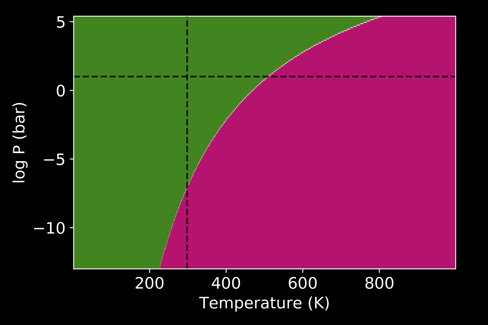

Pressure vs Temperature
=======================

`Surfinpy` has the functionality to generate phase diagrams as a function of pressure vs temperature based upon the methodology used in Molinari et al. 
(J. Phys. Chem. C  116, 12, 7073-7082) according to

.. math::
    \gamma_{adsorbed, T, P} = \gamma_{bare} + ( C ( E_{ads, T} - RTln(\frac{p}{p^o})

where :math:`\gamma_{adsorbed, T, p}` is the surface energy of the surface with adsorbed species at temperature (T) and pressure (P), 
:math:`\gamma_{bare}` is the suface energy of the bare surface, C is the coverage of adsorbed species, :math:`E_{ads}` is the adsorption energy, 

.. math::
    E_{ads, T} =  E_{slab, adsorbant} - (E_{slab, bare} + n_{H_2O} E_{H_2O, T}) / n_{H_2O}

where :math:`E_{slab, adsorbant}` is the energy of the surface and the adsorbed species, :math:`n_{H_2O}` is he number of adsorbed species, 

.. math::
    E_{H_2O, (T)} = E_{H_2O, (g)} - TS_{(T)}

where :math:`S_{(T)}` is the experimental entropy of gaseous water in the standard state.

Usage
~~~~~

.. code-block:: python

    from surfinpy import utils as ut
    from surfinpy import p_vs_t

    adsorbant = -14.00
    SE = 1.40

    stoich = {'Cation': 24, 'X': 48, 'Y': 0, 'Area': 60.22,
              'Energy': -575.00, 'Label': 'Bare'}
    H2O =    {'Cation': 24, 'X': 48, 'Y': 2, 'Area': 60.22, 
              'Energy': -605.00, 'Label': '1 Water'}
    H2O_2 =  {'Cation': 24, 'X': 48, 'Y': 8, 'Area': 60.22, 
              'Energy': -695.00, 'Label': '2 Water'}
    data = [H2O, H2O_2]

    coverage = ut.calculate_coverage(data)

    thermochem = ut.read_nist("H2O.txt")

    system = p_vs_t.calculate(stoich, data, SE, 
                              adsorbant, 
                              thermochem, 
                              coverage)
    system.plot()

.. image:: Figures/Tutorial_2/First.png
    :height: 300px
    :align: center

Alternatively you can also tweak the style

.. code-block:: python

    system.plot(output="dark_pvt.png", 
                set_style="dark_background",
                colourmap="PiYG")

