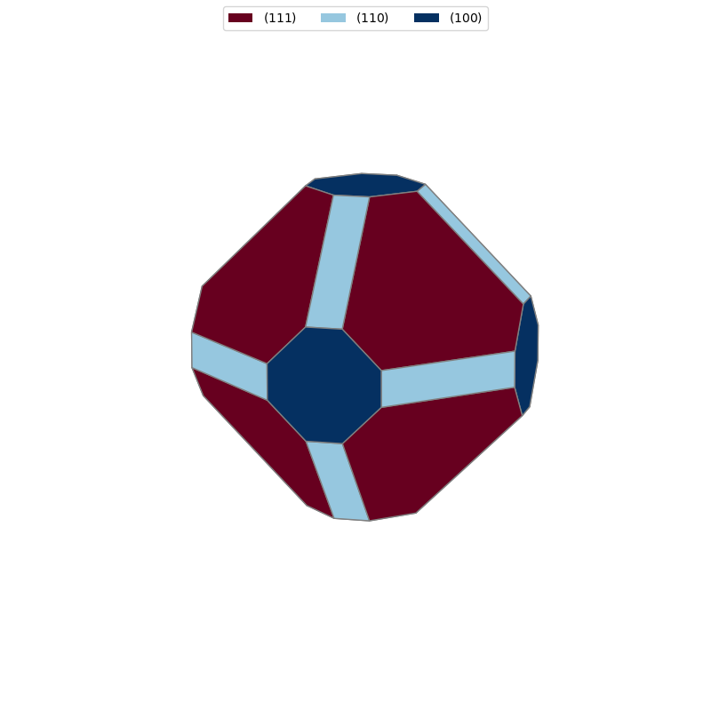

Particle Morphology
===================

It is sometimes useful to use surface energies in order to generate particle morphologies. 
This tutorial demonstrates how to obtain surface energies for surfaces containing adsorbed species using `surfinpy`. 
With these you can then generate a wulff construction using `pymatgen <https://www.sciencedirect.com/science/article/pii/S0927025612006295?via%3Dihub>`_. 
A Wulff construction is a method to determine the equilibrium shape of a crystal. 
So by calculating the surface energies of multiple different surfaces, at different temperature and pressure values we can generate a particle morphology for the material,
in the prescence of an adsorbing species, at a specific temperature and pressure. 

`surfinpy` has a module called wulff that will return a surface energy at a given temperature and pressure value. 
These can then be used in conjunction with Pymatgen for a wulff construction. 
So first we need to declare the data for each surface and calculate the surface energies. 
As an aside, it is possible to provide multiple coverages, the return will be an array of surface energies, 
corresponding to each surface coverage, you would then select the minimum value with `np.amin()`

.. code-block:: python

    import numpy as np
    from surfinpy import p_vs_t as pt
    from surfinpy import wulff  
    from surfinpy import utils as ut
    from pymatgen.core.surface import SlabGenerator, 
                                      generate_all_slabs, 
                                      Structure, Lattice
    from pymatgen.analysis.wulff import WulffShape

    adsorbant = -14.22
    thermochem = ut.read_nist('H2O.txt')

The first thing to do is calculate the surface energy at a temperature and pressure value for each surface.

.. code-block:: python

    SE = 1.44
    stoich =      {'M': 24, 'X': 48, 'Y': 0, 'Area': 60.22, 
                  'Energy': -575.66, 'Label': 'Stoich'}
    Adsorbant_1 = {'M': 24, 'X': 48, 'Y': 2, 'Area': 60.22, 
                   'Energy': -609.23, 'Label': '1 Species'}
    data = [Adsorbant_1]
    Surface_100_1 = wulff.calculate_surface_energy(stoich, 
                                                   data, 
                                                   SE, 
                                                   adsorbant, 
                                                   thermochem, 
                                                   298, 
                                                   0)

    SE = 1.06
    stoich =      {'M': 24, 'X': 48, 'Y': 0, 'Area': 85.12, 
                   'Energy': -672.95, 'Label': 'Stoich'}
    Adsorbant_1 = {'M': 24, 'X': 48, 'Y': 2, 'Area': 85.12, 
                   'Energy': -705.0, 'Label': '1 Species'}
    data = [Adsorbant_1]
    Surface_110_1 = wulff.calculate_surface_energy(stoich, 
                                                   data, 
                                                   SE, 
                                                   adsorbant, 
                                                   thermochem, 
                                                   298, 
                                                   0)

    SE = 0.76
    stoich =      {'M': 24, 'X': 48, 'Y': 0, 'Area': 77.14, 
                   'Energy': -579.61, 'Label': 'Stoich'}
    Adsorbant_1 = {'M': 24, 'X': 48, 'Y': 2, 'Area': 77.14, 
                   'Energy': -609.24, 'Label': '1 Species'}
    data = [Adsorbant_1]
    Surface_111_1 = wulff.calculate_surface_energy(stoich, 
                                                   data, 
                                                   SE, 
                                                   adsorbant, 
                                                   thermochem, 
                                                   298, 
                                                   0)

The with these surface energies we can build a particle morphology using pymatgen

.. code-block:: python

    lattice = Lattice.cubic(5.411)
    ceo = Structure(lattice,["Ce", "O"],
                   [[0,0,0], [0.25,0.25,0.25]])
    surface_energies_ceo = {(1,1,1): np.amin(Surface_111_1), 
                            (1,1,0): np.amin(Surface_110_1), 
                            (1,0,0): np.amin(Surface_100_1)}

    miller_list = surface_energies_ceo.keys()
    e_surf_list = surface_energies_ceo.values()

    wulffshape = WulffShape(ceo.lattice, miller_list, e_surf_list)
    wulffshape.show(color_set="RdBu", direction=(1.00, 0.25, 0.25))

