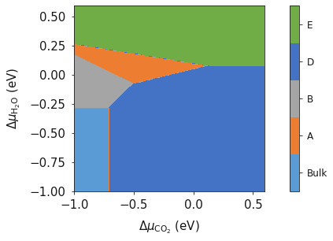

Chemical Potential
==================

In this tutorial we learn how to generate a basic bulk phase diagram from DFT energies.  This enables the comparison of the thermodynamic stability of various different bulk phases under different chemical potentials giving valuable insight in to the syntheis of solid phases.  This example will consider a series of bulk phases which can be defined through a reaction scheme across all phases, thus for this example including MgO, :math:`H_2O` and :math:`CO_2` as reactions and A as a generic product.

.. math::
    x\text{MgO} + y\text{H}_2\text{O} + z\text{CO}_2 \rightarrow \text{A}

The system is in equilibrium when the chemical potentials of the reactants and product are equal; i.e. the change in Gibbs free energy is :math:`$\delta G_{T,p} = 0$`.

.. math::
	\delta G_{T,p} = \mu_A - x\mu_{\text{MgO}} - y\mu_{\text{H}_2\text{O}} - z\mu_{\text{CO}_2} = 0

Assuming that :math:`H_2O` and :math:`CO_2` are gaseous species, :math:`$\mu_{CO_2}$` and :math:`$\mu_{H_2O}$` can be written as

.. math::
	\mu_{\text{H}_2\text{O}} = \mu^0_{\text{H}_2\text{O}} + \Delta\mu_{\text{H}_2\text{O}}

and 

.. math::
	\mu_{\text{CO}_2} = \mu^0_{\text{CO}_2} + \Delta\mu_{\text{CO}_2}

The chemical potential :math:`$\mu^0_x$` is the partial molar free energy of any reactants or products (x) in their standard states, in this example we assume all solid components can be expressed as

.. math::
    \mu_{\text{component}} = \mu^0_{\text{component}}

Hence, we can now rearrange the equations to produce;

.. math::
	\mu^0_A - x\mu^0_{\text{MgO}} - y\mu^0_{\text{H}_2\text{O}} - z\mu^0_{CO_2} = y\Delta\mu_{H_2O} + z\Delta\mu_{CO_2}

As :math:`$\mu^0_A$` corresponds to the partial molar free energy of product A, we can replace the left side with the Gibbs free energy (:math:`$\Delta G_{\text{f}}^0$`).

.. math::
	\delta G_{T,p} = \Delta G_{\text{f}}^0 - y\Delta\mu_{\text{H}_2\text{O}} - z\Delta\mu_{\text{CO}_2}

At equilibrium :math:`$\delta G_{T,p} = 0$`, and hence

.. math::
	\Delta G_{\text{f}}^0 = y\Delta\mu_{\text{H}_2\text{O}} + z\Delta\mu_{\text{CO}_2}

Thus, we can find the values of :math:`$\Delta\mu_{H_2O}$` and :math:`$\Delta\mu_{CO_2}$` (or :math:`$(p_{H_2O})^y$` and :math:`$p_{CO_2}^z$` when Mg-rich phases are in thermodynamic equilibrium; i.e. they are more or less stable than MgO.  This procedure can then be applied to all phases to identify which is the most stable, provided that the free energy :math:`$\Delta G_f^0$` is known for each Mg-rich phase.

The free energy can be calculated using

.. math::
    \Delta G^{0}_{f} = \sum\Delta G_{f}^{0,\text{products}} - \sum\Delta G_{f}^{0,\text{reactants}}

Where for this tutorial the free energy (G) is equal to the calculated DFT energy (:math:`U_0`).

.. code-block:: python

    import matplotlib.pyplot as plt
    from surfinpy import bulk_mu_vs_mu as bmvm
    from surfinpy import utils as ut
    from surfinpy import data

The first thing to do is input the data that we have generated from our DFT simulations. The input data needs to be contained within a class. First we have created the class for the bulk data, where 'Cation' is the number of cations, 'Anion' is the number of anions, 'Energy' is the DFT energy and 'F-Units' is the number of formula units.

.. code-block:: python

    bulk = data.ReferenceDataSet(cation = 1, anion = 1, energy = -92.0, funits = 10)

Next we create the bulk phases classes - one for each phase. 'Cation' is the number of cations, 'x' is in this case the number of water species (corresponding to the X axis of the phase diagram), 'y' is the number of in this case :math:`CO_2` molecules (corresponding to the Y axis of our phase diagram), 'Energy' is the DFT energy and finally 'Label' is the label for the phase (appears on the phase diagram).

.. code-block:: python

    MgO = data.DataSet(cation = 10, x = 0, y = 0, energy = -92.0, label = "Periclase")
    Art = data.DataSet(cation = 10, x = 5, y = 20, energy = -468.0, label = "Artinite")
    Bru = data.DataSet(cation = 10, x = 0, y = 10, energy = -228.0, label = "Brucite")
    Nes = data.DataSet(cation = 10, x = 10, y = 30, energy = -706.0, label = "Nesquehonite")
    Mag = data.DataSet(cation = 10, x = 10, y = 0, energy = -310.0, label = "Magnesite")
    Lan = data.DataSet(cation = 10, x = 10, y = 50, energy = -972.0, label = "Lansfordite")
    Hyd = data.DataSet(cation = 10, x = 8, y = 10, energy = -398.0, label = "Hydromagnesite")

Next we need to create a list of our data. Don't worry about the order, `surfinpy` will sort that out for you. 

.. code-block:: python

    data = [MgO, Art, Bru, Nes,  Mag, Lan, Hyd]

We now need to generate our X and Y axis, or more appropriately, our chemical potential values. These exist in a dictionary. 'Range' corresponds to the range of chemcial potential values to be considered and 'Label' is the axis label.  Additionally, the x and y energy need to be specified.

.. code-block:: python

    deltaX = {'Range': Range of Chemical Potential,
              'Label': Species Label}

.. code-block:: python

    deltaX = {'Range': [ -3, 2],  'Label': 'CO_2'}
    deltaY = {'Range': [ -3, 2], 'Label': 'H_2O'}
    x_energy=-20.53412969
    y_energy=-12.83725889

And finally we can generate our plot using these 6 variables of data. 

.. code-block:: python

    system = bmvm.calculate(data, bulk, deltaX, deltaY, x_energy, y_energy)

    ax = system.plot_phase()
    plt.show()

.. image:: Figures/Bulk_1.png
    :height: 300px
    :align: center

Temperature
-----------

In the previous example we generated a phase diagram at 0 K.  However, this is not representative of normal conditions.  
Temperature is an important consideration for materials chemistry and we may wish to evaluate the phase thermodynamic stability at various synthesis conditions.  
This example will again be using the :math:`MgO-CO_2-H_2O` system.

As before the free energy can be calculated using;

.. math::
    \Delta G^{0}_{f} = \sum\Delta G_{f}^{0,\text{products}} - \sum\Delta G_{f}^{0,\text{reactants}}

Where for this tutorial the free energy (G) for solid phases  is equal to is equal to the calculated DFT energy :math:`(U_0)`. 
For gaseous species, the standard free energy varies significantly with temperature, and as DFT simulations are designed for condensed phase systems, 
we use experimental data to determine the temperature dependent free energy term for gaseous species, 
where :math:`$S_{expt}(T)$` is specific entropy value for a given T and  :math:`$H-H^0(T)$` is the , both can be obtained from the NIST database and can be calculated as;

.. math::
    G =  U_0 + (H-H^0(T) - T S_{\text{expt}}(T))

.. code-block:: python

    from surfinpy import bulk_mu_vs_mu as bmvm
    from surfinpy import utils as ut
    from surfinpy import data

.. code-block:: python

    bulk = data.ReferenceDataSet(cation = 1, anion = 1, energy = -92.0, funits = 10)

    MgO = data.DataSet(cation = 10, x = 0, y = 0, energy = -92.0, label = "Periclase")
    Art = data.DataSet(cation = 10, x = 5, y = 20, energy = -468.0, label = "Artinite")
    Bru = data.DataSet(cation = 10, x = 0, y = 10, energy = -228.0, label = "Brucite")
    Nes = data.DataSet(cation = 10, x = 10, y = 30, energy = -706.0, label = "Nesquehonite")
    Mag = data.DataSet(cation = 10, x = 10, y = 0, energy = -310.0, label = "Magnesite")
    Lan = data.DataSet(cation = 10, x = 10, y = 50, energy = -972.0, label = "Lansfordite")
    Hyd = data.DataSet(cation = 10, x = 8, y = 10, energy = -398.0, label = "Hydromagnesite")
    data = [MgO, Art, Bru, Nes,  Mag, Lan, Hyd]

    x_energy=-20.53412969
    y_energy=-12.83725889

In order to calculate :math:`$S_{expt}(T)$` for :math:`H_2O` and :math:`CO_2` we need to use experimental data from the NSIT JANAF database.  
As a user you will need to download the tables for the species you are interested in (in this example water and carbon dioxide).  
`surfinpy` has a function that can read this data, assuming it is in the correct format and calculate the temperature correction for you.  
Provide the path to the file and the temperature you want.

.. code-block:: python

    CO2_exp = ut.fit_nist("CO2.txt")[298]
    Water_exp = ut.fit_nist("H2O.txt")[298]

    CO2_corrected = x_energy + CO2_exp
    Water_corrected = y_energy + Water_exp

    deltaX = {'Range': [ -3, 2],  'Label': 'CO_2'}
    deltaY = {'Range': [ -3, 2], 'Label': 'H_2O'}

CO2_corrected and H2O_corrected are now temperature depenent terms correcsponding to a temperature of 298 K. The resulting phase diagram will now be at a temperature of 298 K.

.. code-block:: python

    system = bmvm.calculate(data, bulk, deltaX, deltaY, x_energy=CO2_corrected, y_energy=Water_corrected)

    system.plot_phase(temperature=298)

.. image:: Figures/Bulk_2.png
    :height: 300px
    :align: center

Pressure
--------

In the previous example we went through the process of generating a simple phase diagram for bulk phases and introducing temperature dependence for gaseous species.  
This useful however, sometimes it can be more beneficial to convert the chemical potenials (eVs) to partial presure (bar). 

Chemical potential can be converted to pressure values using

.. math::
    P & = \frac{\mu_O}{k_B T} ,

where P is the pressure, :math:`$\mu$` is the chemical potential of oxygen, $k_B$ is the Boltzmnann constant and T is the temperature. 

.. code-block:: python

    import matplotlib.pyplot as plt
    from surfinpy import bulk_mu_vs_mu as bmvm
    from surfinpy import utils as ut
    from surfinpy import data

    colors = ['#5B9BD5', '#4472C4', '#A5A5A5', '#772C24', '#ED7D31', '#FFC000', '#70AD47']

Additionally, `surfinpy` has the functionality to allow you to choose which colours are used for each phase.  Specify within the DataSet class color. 

.. code-block:: python

    bulk = data.ReferenceDataSet(cation = 1, anion = 1, energy = -92.0, funits = 10)

    MgO = data.DataSet(cation = 10, x = 0, y = 0, energy = -92.0, color=colors[0], label = "Periclase")
    Mag = data.DataSet(cation = 10, x = 10, y = 0, energy = -310.0, color=colors[1], label = "Magnesite")
    Bru = data.DataSet(cation = 10, x = 0, y = 10, energy = -228.0, color=colors[2], label = "Brucite")
    Hyd = data.DataSet(cation = 10, x = 8, y = 10, energy = -398.0, color=colors[3], label = "Hydromagnesite")
    Art = data.DataSet(cation = 10, x = 5, y = 20, energy = -468.0, color=colors[4], label = "Artinite")
    Nes = data.DataSet(cation = 10, x = 10, y = 30, energy = -706.0, color=colors[5], label = "Nesquehonite")
    Lan = data.DataSet(cation = 10, x = 10, y = 50, energy = -972.0, color=colors[6], label = "Lansfordite")

    data = [MgO, Art, Bru, Nes,  Mag, Lan, Hyd]

    x_energy=-20.53412969
    y_energy=-12.83725889

    CO2_exp = ut.fit_nist("CO2.txt")[298]
    Water_exp = ut.fit_nist("H2O.txt")[298]

    CO2_corrected = x_energy + CO2_exp
    Water_corrected = y_energy + Water_exp

    deltaX = {'Range': [ -1, 0.6],  'Label': 'CO_2'}
    deltaY = {'Range': [ -1, 0.6], 'Label': 'H_2O'}

    system = bmvm.calculate(data, bulk, deltaX, deltaY, x_energy=CO2_corrected, y_energy=Water_corrected)

    system.plot_phase()

To convert chemical potential to pressure use the plot_pressure command and the temperature at which the pressure is calculated.  For this example we have used 298 K.

.. code-block:: python

    system.plot_pressure(temperature=298)

.. image:: Figures/Bulk_4.png
    :height: 300px
    :align: center